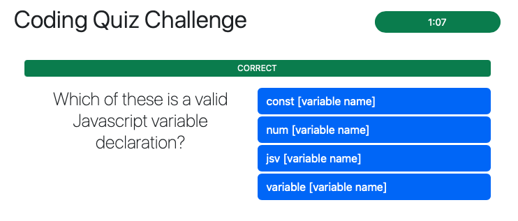
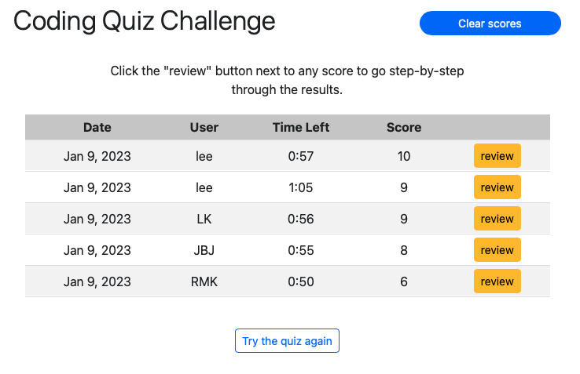
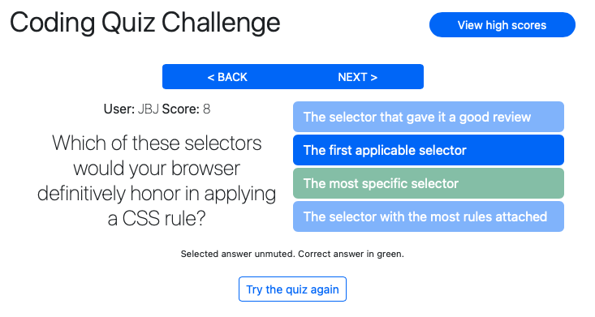

# Coding Quiz

## Description

This is a web page that allows a user to take a timed quiz on front-end coding. The quiz has ten randomly-sorted questions and a 90-second time limit.

At the conclusion of the quiz, the user has the option to store his results locally. They can view a table of those stored results, and choose any of them to review, going question by question to see the correct answers and the ones they picked.

You can access the page at [this location](https://lkalliance.github.io/module-4-challenge/).

## Usage

The page welcomes the user to take the quiz. Upon clicking to start the quiz, the user steps through question-by-question. The questions each have four clickable options (though the code allows for more than that). The questions are randomized, and so are each question's options.

After clicking each question and advancing to the next one, a banner appears to inform them of their result on the previous question. In the upper right corner, a timer counts down. Answering a question incorrectly deducts a five-second penalty from the timer.

Upon completion of the quiz, the user is invited to submit their score to a locally-stored list of scores. Whether or not they choose to do so, they can view that list, which is sorted by score, and then by time remaining. Each result also has a "Review" button; clicking it allows the user to review the answers the quiz-taker gave. On each question, the user sees which option was clicked, and which option was the correct one.

The user can take the quiz as many times as they wish, and can opt to score each result in the table. They can also click a button on the high scores page to clear out all the scores, and start from scratch.

The page is responsive: as the screen gets narrower, the page elements stack in a column instead of side-by-side. The high scores table, as it gets narrower, hides the less-important columns.

## Installation

There are no installations necessary for this page to operate. It currently uses just HTML, CSS and Javascript; technologies that are built into any web browser. The browser DOES need to have Javascript enabled.

## Notes on Design

### User Interface

There were a couple of design decisions I thought about for a while. There is currently no way for a user to abandon a quiz, short of reloading the page. This was a conscious decision on my part. I also, for simplicity, opted to have one and only one item in the upper right corner of the page (or, below the main headline in the narrow-window version). That is either a button/link to the High Scores page, a button/link to clear the high scores, or the quiz timer.

I did color-code the timer: when it gets to 20 seconds remaining it turns from blue to yellow, and when it gets to 10 seconds remaining it turns to red.

Finally, there was one thing I had in the code that was eliminated during bugfixing: after the last question, I had the page delay for a second rather than go immediately to the "Submit your score" page. This allowed the user to see, for a second, the result of his last answer. I hope to put that back in at a later date.

### Code

From the start I intended to make the Javascript operate mostly inside functions. There are some global functions and a lot of global const values (almost all of them references to DOM containers), but all the real stuff happens inside of functions. The biggest issue that came of that decision was in the area of event listeners: some of them had to reference locally-scoped callbacks, which meant they had to be assigned locally, which meant they often had to be REMOVED as well to prevent the accumulation of multiple listeners of the same type. I have assigned them globally where I can.

In a "real" web app of this type, I would get the questions from a server, likely pre-randomized and with the options pre-randomized as well. This is a purely front-end project, however, so the questions and options are hard-coded into the Javascript. It is flexible, though: I could add as many or as few questions as I wished. I suppose I could even put in a library of many more questions and construct a given quiz from a random selection...but that would be more appropriate for the back end.

Readers of the code will find a LOT of comments I have inserted. You should not be at a loss for explanation of what each function does and how it does it.

## Credits

The code was all authored by me, with occasional guidance from outstanding authors and commenters from around the web, most specifically at [W3Schools](https://w3schools.com/), [MDN](https://developer.mozilla.org/en-US/) and [Stack Overflow](https://stackoverflow.com).

This site was built using the [jQuery Javascript library](https://jquery.com) and [Bootstrap dev framework](https://getbootstrap.com).

## License

This web application is covered by the MIT license.

